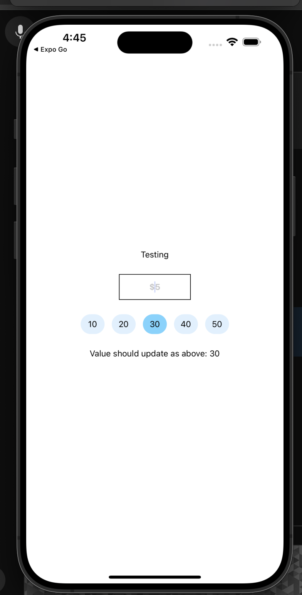

# Expo Demo

## Installation

```bash
yarn install
```

## Running the app

```bash
yarn ios
```

## Issues

> Demo on bugs [issues/#123](https://github.com/IvanIhnatsiuk/react-native-advanced-input-mask/issues/113) of `react-native-advanced-input-mask`

MaskInput change event on working using expo development build

- Try change value in the input, value state is not changing
- Also, update state value does not update value in input also (try click on the badge number)



